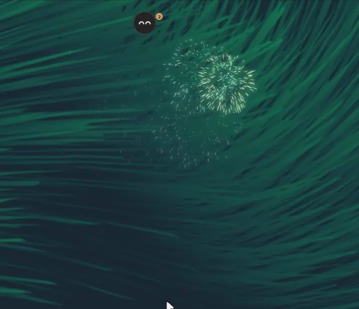
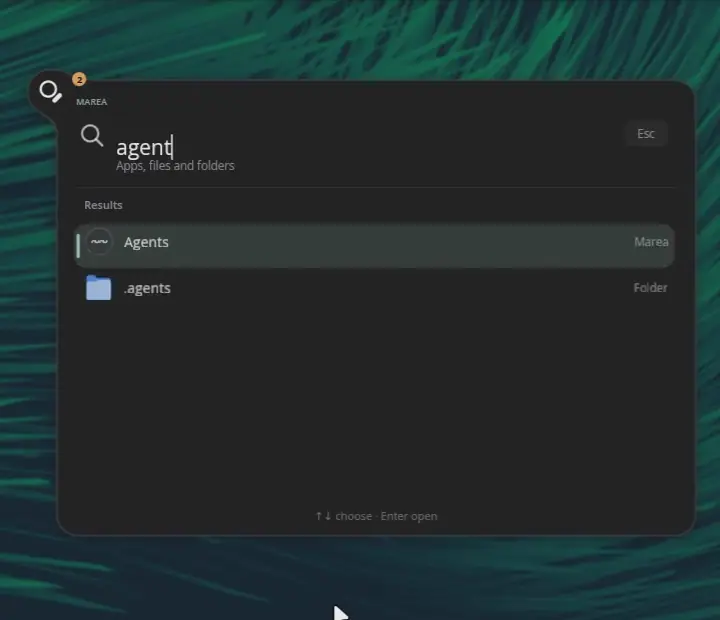

<div align = center>


<br>

[![Badge License]][License]
![Badge Language]
![Badge Commit]
[![Badge Issues]][Issues]
[![Badge Discord]][Discord]
[![Badge X]][X]
[![Badge Ko-fi]][Ko-fi]

<br>

Marea is a desktop companion: a little ball with a face that lives at the top of
your screen and is your whole shell — notifications, control center, finder,
screenshots, lock screen — written in [pleamar], on any Wayland compositor.

<br>

---

**[<kbd> <br> Install <br> </kbd>][Install]**
**[<kbd> <br> Use <br> </kbd>][Use]**
**[<kbd> <br> pleamar <br> </kbd>][pleamar]**
**[<kbd> <br> pleamar-wm <br> </kbd>][pleamar-wm]**
**[<kbd> <br> Discord <br> </kbd>][Discord]**

---

<br>


<sub>Her settings, and her skin going from dark to liquid glass.</sub>

<br>
<br>

</div>

# Features

- **Notifications as drops**: they fall into her and wait there, one colour per
  kind; hover and she shows the latest, open the swell to read them all, with
  their actions. The *Haven* is do-not-disturb that keeps them for later.
- **A control center that grows out of its cards**: Wi-Fi, Bluetooth, sound,
  session, tray, calendar, focus, your AI agents' remaining quota (Claude,
  Codex), settings — each page opens out of its own card.
- **She talks, and can use your desktop for you** (`Super+Shift+A`, her menu,
  the finder): a chat that grows out of her, with her AI —your ChatGPT
  account, signed in from her settings— in a sandbox of its own. With
  [pleamar-wm] she also has hands: a pointer and a keyboard of her own, apart
  from yours, to open the browser, look something up or fill a form while you
  keep working. Looking at a window she does at once; anything that changes
  something is a card you allow or not (or, if you let her, only what sends,
  buys or deletes). Her cursor is a drop of her, the monitor she works on
  glows, and its «Stop» ends it at any moment. Her answers are read as they
  come, at a reading pace.
- **She remembers**: what you tell her about yourself and what you ask her to
  keep, notes on how she did something hard on your desktop, and the
  conversations before this one, to look back on. She keeps it herself, and
  each thing shows in the chat as she keeps it; Settings › What she remembers
  lists it all, and forgets whatever you like.
- **She does things on her own, at a time**: «every day at 8:00, open my
  bank in Zen and tell me the balance». You allow each task as she keeps
  it; at its time it runs by itself, in a conversation of its own, with
  her hands free, and a notice says how it went. If it could not run (the
  screen locked, the computer off, her account out) a notice says why and
  offers to do it now. Settings › Her tasks lists them, with a switch, «do
  it now» and a cross.
- **Passwords for her tasks**: she signs in with the browser's saved ones;
  for a page without one, you keep a password in Marea by a name (Settings ›
  Her tasks › Passwords). It goes to your system keyring (`secret-tool`),
  and Marea types it for her without her ever seeing it.
- **A finder for apps, files and folders**: `Super+Space`, type, Enter. Drag a
  file out of it into any program.
- **Updates and programs, without a terminal** (Arch and its family): she looks
  every three hours for what the repositories and the AUR (yay or paru) have
  new, and Arch's news that ask you to do something first. Update all or some
  with your password in her own field and watch it happen, line by line; then
  she says whether to restart and which settings files (`.pacnew`) to review.
  A program not installed shows up in the finder, and installs the same way.
- **Screenshots and recording**: a piece of the screen, the screen or a window,
  and screen recording, with their own animations and a card to keep them.
- **Her own lock screen** (`ext-session-lock`), checked with PAM.
- **She follows you**: to the monitor with the focus (or the mouse, in
  [pleamar-wm]), leaping from one to the other.
- **A face that lives**: she breathes, looks at the pointer, celebrates, gets
  angry, sleeps, goes on adventures along the bottom of the screen, and wears
  what you pick in her wardrobe.
- **Three looks**: glass that bends what is behind, light glass that blurs it,
  or classic and opaque.
- **In [pleamar-wm]**: windows put away fall into her as drops and become little
  stones with their app's icon; tiled or free windows from her menu.
- **English and Spanish**, the system's language by default.
- **Light**: the same Marea written in Quickshell used 336 MB and took 1.9 s to
  show; this one, 81 MB and 175 ms ([`MEDIDAS.md`](MEDIDAS.md)).

<br>

<div align = center>

# Gallery

<br>



<sub>Her finder, as you type: apps, files, folders, and things she does herself.</sub>

<br>
<br>



<sub>Her Agents page: what is left of your Claude Code and Codex limits, as tanks.</sub>

<br>
<br>

![Preview Finder]

<sub>Her finder, out of the ball: apps, files and folders.</sub>

<br>
<br>

![Preview Desktop]

<sub>At the top of a pleamar-wm desktop, peeking out over the windows.</sub>

<br>
<br>

</div>

# Install

With [pleamar] and [pleamar-wm], in your home, from one line:

```sh
curl -fsSL https://raw.githubusercontent.com/k4ditano/pleamar/main/install.sh | sh
```

That leaves `marea` in `~/.local/bin` and starts her with pleamar-wm. On
**Hyprland** (or any compositor with layer-shell), start her with it and bind
her keys:

```ini
exec-once = marea start
bind = SUPER, Space, exec, marea search
bind = SUPER SHIFT, A, exec, marea chat
bind = SUPER, L, exec, marea lock
bind = , Print, exec, marea shot_region
bind = SHIFT, Print, exec, marea shot_screen
bind = CTRL, Print, exec, marea shot_window
bind = SUPER SHIFT, C, exec, marea record_toggle
```

`pleamar-update` keeps her up to date.

Deriva, the page where she keeps what you drop on her, has its library in
`deriva/` (`deriva-worker`, a local SQLite). She builds it herself the first
time she starts, and again after an update, if Rust (`cargo`) is installed; it
takes a minute, in the background. On Nix it comes built.

Her chat runs in `agent/` (the [Pi](https://www.npmjs.com/package/@earendil-works/pi-coding-agent) SDK)
with Node, inside [bubblewrap](https://github.com/containers/bubblewrap): it
sees its own state folder and the network to its model, nothing else of
yours, and only proposes what to do —she decides and does it—. She fetches its
packages the first time she starts (`npm ci --ignore-scripts`, if `npm` is
there); on Nix they come with her. Its sign-in is kept in
`~/.local/state/marea-plm/agent`; the one of the Marea written in Quickshell
is copied from there the first time, if there was one. Her memory is
in her own folder, `~/.local/share/pleamar/marea/` (`memory.json`, and the
conversations as `chat-*.json`), never in the sandbox: the worker only proposes
what to keep, and she keeps it.

On **Nix**: `nix run github:k4ditano/marea-plm -- start`, or `pkgs.marea` through
this flake's `overlays.default`. On NixOS, [pleamar-wm]'s module brings her
with the whole desktop.

# Use

```sh
marea start          # starts her; her log goes to ~/.local/state/marea-plm/marea.log
marea status         # whether she is running
marea stop
marea report         # if she stutters: measures 30 s while you use her, writes a report to send us
marea chat           # her chat, open or closed (Super+Shift+A in pleamar-wm)
marea search         # any other word is an event she is told:
marea lock           #   search, chat, lock, shot_region, shot_screen, shot_window,
marea shot_region    #   record_toggle, celebrate, rage, adventure…
```

Click her for the control center, right-click for her menu. Her settings (look,
home monitor, whether she follows you, language, wallpaper) are in the last
card, and are saved in `~/.local/share/pleamar/marea/settings.json`.

Two variables, and they are not the same:

- `MAREA_LOCK_WITH_EXIT=1` — the lock also opens with Esc, only after a minute,
  and says so on screen: a way out while the lock screen is new.
- `MAREA_TESTING=1` — locking, logging out, restarting and powering off are only
  written to the log. For rehearsing; never on the one you use.

To try a change without touching the Marea you use: a copy of the scene with
another name (so `pleamar --say` reaches the copy), and
`pleamar --scene copy.plm --screen HDMI-A-1 --margin 390`.

# How she is made

One scene (`marea.plm`) and its logic (`marea.luau`), plus her translations
(`lang/`), wardrobe (`wardrobe/`) and shaders (`shaders/`). The scene is in
pieces: `marea.plm` is its spine, and puts back in order with `include` the
parts under `scene/` —her state, what is seen of her, the control center
with one file per page (`scene/pages/`), the rules and her other surfaces—.
The logic too: what stands on its own (the system pages, Deriva, software,
the chat, the calendar…) is in `logic/`, loaded with `require`. This lives outside
pleamar's repository on purpose: it is what anyone using pleamar would have —
some `.plm`, their `.luau` next to them, and the program already built.
[`ANIMACIONES.md`](ANIMACIONES.md) is how each animation is meant to feel, and
[`MEDIDAS.md`](MEDIDAS.md) the measurements against Quickshell.

# License

Marea is under the [BSD 3-Clause License][License], like Hyprland.

Contributions are welcome, made with AI or without it: see the [AI policy](AI_POLICY.md).

Made by **[@k4ditano][X]** — follow along on X for what comes next, and come
and say hi, ask or show what you made on **[Discord]**.
If it makes your desktop nicer, you can **[buy me a coffee on Ko-fi][Ko-fi]** ☕

<!----------------------------------------------------------------------------->

[Install]: #install
[Use]: #use
[pleamar]: https://github.com/k4ditano/pleamar
[pleamar-wm]: https://github.com/k4ditano/pleamar-wm
[License]: LICENSE
[X]: https://x.com/k4ditano
[Discord]: https://discord.gg/N7kbYC49b2
[Ko-fi]: https://ko-fi.com/k4ditano
[Issues]: https://github.com/k4ditano/marea-plm/issues

<!----------------------------------{ Images }--------------------------------->

[Preview Finder]: assets/finder.png
[Preview Desktop]: assets/desktop.png

<!----------------------------------{ Badges }--------------------------------->

[Badge License]: https://img.shields.io/badge/license-BSD--3--Clause-9ed6bd?style=flat-square
[Badge Language]: https://img.shields.io/badge/made%20with-pleamar%20%2B%20Luau-2c7684?style=flat-square
[Badge Commit]: https://img.shields.io/github/last-commit/k4ditano/marea-plm?style=flat-square&color=9ed6bd
[Badge Issues]: https://img.shields.io/github/issues/k4ditano/marea-plm?style=flat-square&color=2c7684
[Badge Discord]: https://img.shields.io/badge/chat-Discord-5865f2?style=flat-square&logo=discord&logoColor=white
[Badge X]: https://img.shields.io/badge/follow-@k4ditano-000000?style=flat-square&logo=x
[Badge Ko-fi]: https://img.shields.io/badge/support-Ko--fi-ff5e5b?style=flat-square&logo=ko-fi&logoColor=white
