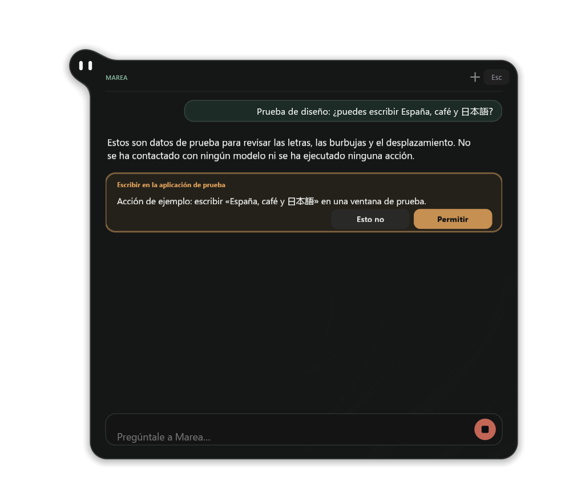
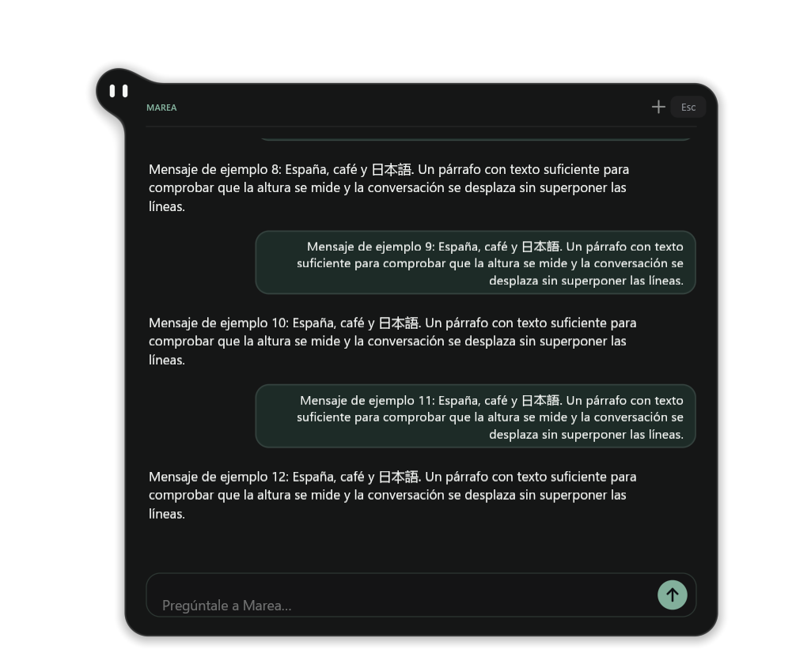
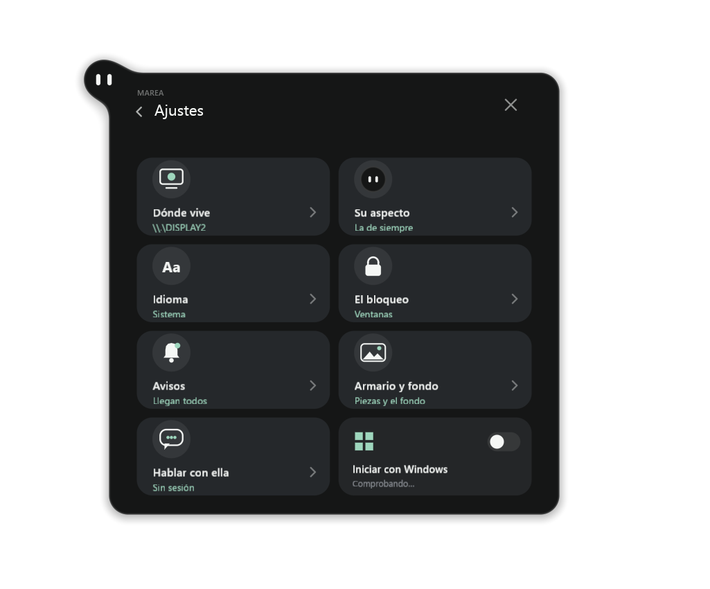

# Native AI agent: integration status

This work ports upstream Marea's new Pi-based chat to Windows. It is not yet
included in the installed preview.13 bundle. The full feature must not be
advertised as complete until account, positive input, UI and installer tests
below pass.

The [native host](agent-host/README.md) runs the pinned Node/SDK worker inside
an AppContainer with restricted files, processes, environment and handles.
Marea's ordinary Luau process retains the approval cards and native desktop
services. The model only proposes tool calls; it never receives a raw HWND,
Win32 handle or direct desktop access through its sandbox.

`desktop-agent.luau` implements the bridge to pleamar's `desktop.*` service.
Window/monitor queries return a catalog and cancellation epoch. Pictures are
base64 PNG data through the existing bounded pipe, avoiding extra filesystem
grants. Stop invalidates queued native actions immediately; late replies cannot
enter a cancelled/new conversation. Shared application launching now waits for
the actual native callback and reports errors instead of assuming success.

New conversations wait for the previous worker to exit before accepting a
message; text typed during shutdown stays in the input field. A failed worker's
unsent messages are discarded before another conversation starts. On Windows,
the SDK retires after 30 idle seconds when both chat and its account settings
are hidden; reopening either restores the three-minute allowance. Active turns,
approval requests and sign-in have no idle deadline. Linux keeps three minutes.
Idle retirement and model changes use the same two-second shutdown deadline. A helper that
does not exit is killed, and stale output/exit callbacks cannot affect its
replacement. These lifecycle cases are covered by the isolated chat test.

| Area | Current evidence / limitation |
| --- | --- |
| Native host + SDK startup | Real Windows isolation and signed-out startup/shutdown verified; no model conversation yet |
| Account login | Device-code path implemented and offline cancellation tested; real account validation pending |
| Window catalog and capture | Actual owned windows on DISPLAY2; resize, modal dialog and closed/reopened identities verified |
| Marea-to-native bridge | Actual Luau scene on DISPLAY2 delivered a PNG; cancellation and clean exit verified |
| Click/type/key/hotkey/scroll/drag | Native implementation exists; positive input and application acceptance tests pending |
| Foreground / independent input | Windows uses shared input. No separate compositor keyboard, pointer, glow or stop pill is claimed |
| Full Marea chat UI / performance | Six actual DX12 layout states captured on DISPLAY2 with example data; real account, conversation, physical interaction and sustained UI measurements remain pending |
| Installer | Full Setup lifecycle passed again in Windows CI at `14d6bf6` / pleamar `c59ae3d`: Unicode install, SDK isolation/state preservation, locked-update failure, tamper rejection/repair, uninstall and optional startup. This is automated acceptance, not graphical validation |

The worker prompt and tool descriptions distinguish Windows's shared input
from Linux's compositor input. Windows may deny activation or input to protected
applications. Acceptance of an OS input request does not mean the application
completed the task; the agent must look again and verify the result.

Run portable checks from the repository root:

```powershell
Push-Location agent
npm ci --ignore-scripts --no-audit --no-fund
Pop-Location
node --test agent/state-image.test.mjs agent/auth-interaction.test.mjs agent/desktop-policy.test.mjs
python windows/test-logic.py --binary ..\pleamar\target\release\pleamar.exe --luau-runner ..\pleamar\target\release\examples\luau-test.exe
```

Six Node tests and twenty isolated Luau suites passed on 2026-10-05. These
checks do not authenticate, contact a model or automate the desktop.

The native packaging check also starts the full SDK, preserves an existing
owned state marker, keeps production and validation profile caches separate,
and removes each profile without deleting chat state. Reproduce on an **owned,
uninstalled** bundle with `windows/test-agent-package.ps1 -Package <bundle>`.
The SDK inventory contains 13,104 files including its runtimes and licenses.
An initial cold permission preparation took about 116 seconds locally; a
repeat preparation took 4.6 seconds, and signed-out readiness/shutdown completed
in 6.8 seconds. Setup prepares permissions before first use; these observations
are not a sustained memory/latency benchmark or authenticated chat test.

`python windows/measure-agent.py --package <owned-complete-bundle> --output
<new-directory> --seconds 15 --cycles 3` measures the actual signed-out SDK in
separate account state without opening a window. Three local cycles on
2026-10-05 ended at 84.7–85.3 MiB working set, 92.9–93.6 MiB private memory and
114 handles. Warm readiness took 2.3–2.4 seconds; idle CPU used about 1.0–1.2%
of one logical core over each 15-second sample. Every Node process exited with
its host and the validation profile was removed. These short observations do
not measure Marea's UI, authenticated responses or long sessions.

For the real bridge, build pleamar's release executable and lib-test executable
(`cargo test --release --locked --lib --no-run` prints its path), then pass both:

```powershell
python windows/test-desktop-runtime.py --binary <pleamar.exe> --fixture-test-binary <pleamar-lib-test.exe>
```

This test refuses to proceed without active **non-primary DISPLAY2**. It opens
only owned fixture/test windows there and sends no physical input. The returned
evidence directory includes the native scene log, facts and exit status. It
tests the actual adapter source rather than a duplicate implementation.

## Native layout review, October 5

`windows/test-chat-ui.py --binary <pleamar.exe> --harness <pleamar-lib-test.exe>
--output <new-directory>` captures only the non-activating scene it starts on
non-primary DISPLAY2. It requires the engine's `native_scene_capture` ignored
test and performs no physical input. The full generated PLM runs with bounded
fixture Luau and separate state; login codes, messages and approvals are example
data. This is a layout regression test, not authenticated chat acceptance.

All six states passed and their PNGs were reviewed: signed out, login code,
account settings, approval card, settings menu and a long conversation. Spanish
accents and Japanese glyphs rendered without missing letters or overlapping
lines in these scenes. The eight settings tiles fit, including Windows startup.
The foreground window stayed unchanged and the owned scene exited with code 0.

The long conversation exposed a shared layout bug: row reflow disabled following
the end without a user gesture, hiding messages 11 and 12. Following now releases
only on upward wheel/drag input and resumes after a settled return to the end.
The native test verifies that the final 12-message layout remains attached and
ends at exactly the 404-unit viewport. Physical scrolling still needs acceptance
testing. Windows account settings now explain that actions share the user's
mouse and keyboard.





Linux retains upstream's compositor tools and sandbox. Windows/Ubuntu logic
and the Windows installer lifecycle passed at Marea `14d6bf6` with pleamar
`c59ae3d` (runs `37299027748` and `37299030286`). These runs precede the layout
correction above. Implemented with Codex.
