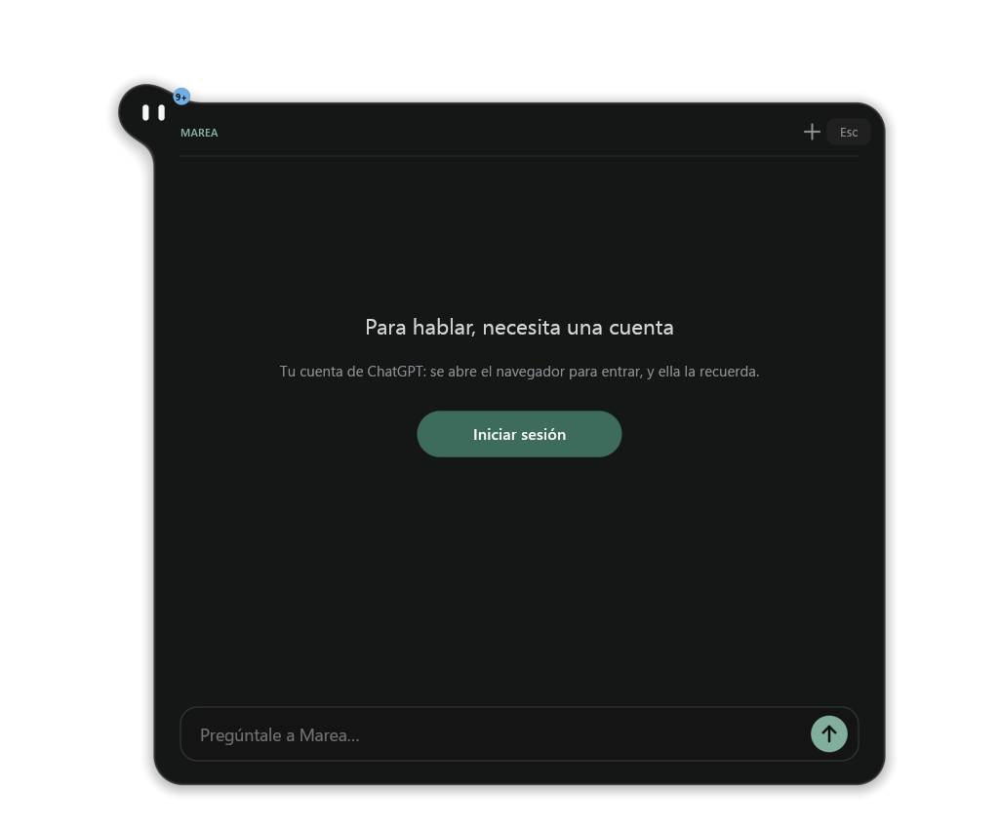
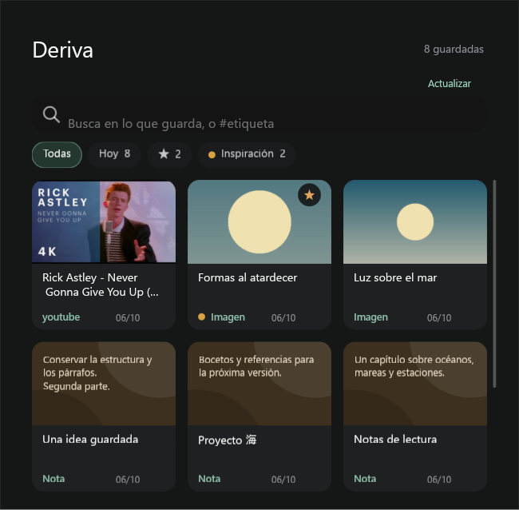
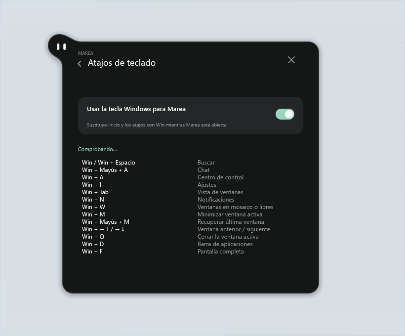

# Marea on the Windows desktop

This separate profile uses the native Windows x64/MSVC port of pleamar, with
Luau, Win32 and DirectComposition/DX12. Windows adapters remain separate from
the upstream Linux profile.

In **Settings**, **Hide automatically** (Spanish: **Ocultarse automáticamente**)
lets Marea tuck into the upper edge after 2.6 seconds without interaction, once
her panels are closed. Approaching her visible face brings her back. Turn it off
for **Always visible** (**Permanecer visible**). Auto-hide defaults to on, matching
Linux; the choice is stored as `auto_hide` in the scene's `settings.json` and
survives restart. A failed write reports an error and leaves the previous choice
in effect. Sleeping after 45 seconds idle is a separate behavior.
No WSL, Wayland, Unix shell or Linux helper programs are required.

Integration status (2026-10-06): the current modular upstream profile generates
and compiles with Luau. The sound, radio and Deriva pages have isolated logic
and native rendering coverage. Whole-profile installed acceptance and the
remaining capability gaps below still prevent a complete-port claim. The
installation and revision-specific acceptance evidence are recorded in the PR;
source changes alone do not update an existing installation.

The mixer binds each press to a native session identity and keeps its row order
until release. Reordering or ending streams cannot transfer a volume gesture
to a different application. The generated-logic regression covers delayed
presses, replacement sessions, release and continued movement during reordering;
physical dragging with real applications remains an acceptance check.

`python windows/test-deriva-cards.py --binary PATH --output NEW_DIRECTORY`
rehearses the current generated cards in a native window on non-primary
DISPLAY2. An internal renderer mouse script checks that an empty slot ignores
a click, the real card emits its original URL exactly once, and scrolling over
the card reaches the library. The owned window is passive; no physical input or
browser launch occurs. This passed with the six-slot profile on 2026-10-06.

The complete generated profile also passed one native signed-out SDK
open/retire cycle on DISPLAY2 with engine `8851092`. Three captures were
inspected, foreground stayed unchanged, and the whole owned process family
exited. The 35-second samples measured 269.3 MiB private commit initially,
367.4 MiB with the SDK open, and 275.3 MiB after retirement; these are not
resident RAM figures. The worker retired after 30.1 seconds. This includes
the real profile and SDK, excludes the supervisor and quota reader, and ran
alongside a background Rust build. It is not a sustained-performance or
physical-interaction acceptance test. The first preparation attempt timed out
before any scene opened; cleanup succeeded, then diagnostic and full retries
prepared successfully in 34.5 and 11.2 seconds. The first timeout's cause
remains unconfirmed. [Measurements and scope](../docs/windows-modular-profile/evidence.json).



The adapted radio pages retain five visible Wi-Fi rows with scrolling and
separate Bluetooth paired/nearby lists with pagination. Native commands use
exact adapter/profile and device identities. Saved profiles can be forgotten;
explicitly sharing the connected Wi-Fi profile obtains its phone QR/password
only when Windows permits plaintext access. Closing sharing, navigating away,
changing connection or retiring the scene clears it. Audio-only Bluetooth
container IDs never stand in for a physical pairing to remove. Unsupported
device connection controls show information instead of claiming success.

`python windows/test-device-controls.py --luau-runner PATH` covers duplicate
names on different adapters, password cleanup, cancellation, late readback,
stale queries, long catalogs, command errors and language refresh. Native
DISPLAY2 fixtures at 125% DPI rendered the current pages with mocked catalogs;
five captures were inspected, with no physical input or device changes and
unchanged foreground focus. IPC assertions verified password cancellation,
Lua-driven page navigation and paging. Earlier harness failures were recorded
separately. These fixtures do not validate physical Wi-Fi connection/sharing,
Bluetooth pairing/removal or full installed-Marea interaction.

The profile generator now preserves resource paths from nested parts when
flattening shaders/accessories into the Windows app. `test-profile-source.py`
covers nested includes, resource paths with spaces/Unicode, recursion and
explicit module dependency mapping. Two shared upstream issues are corrected:
sound labels preserve UTF-8 characters, and cancelling a Wi-Fi password prompt
forwards its event to Lua so the entered password is cleared.

Deriva retains the upstream six-card layout, folder chips, favourites, trash,
restore and searches. An in-flight search and only the newest queued query share
one native stdio worker; old responses cannot replace newly typed results. The
worker releases its optional semantic model after two minutes without a search.
Only visible covers are converted, one at a time, through the engine's native
`images.thumbnail` service. No ImageMagick, `mkdir`, `test`, `wl-copy` or shell
pipeline is needed. This requires the matching engine with `images` permission.

Public YouTube, Open Graph, X and Reddit metadata is fetched outside the offline
worker, with bounded redirects, time and response sizes and no browser cookies.
Images are fitted to 800 pixels and then cropped to the card ratio. The helper
is included in source install, update and Setup. Native image decoding supports
JPEG, PNG, WebP, BMP, the first GIF frame and self-contained SVG vectors. HEIC,
AVIF and SVGs with text or embedded/external images currently use the normal
file card instead of a preview. Download staging is bounded separately from
the smaller rendered cache. Notes retain Unicode and paragraph spacing; copying
reports success only after Windows accepts the clipboard write. File addresses
escape spaces, Unicode, `#` and `%`; captures from older Windows workers remain
readable. A failed favourite write rolls back its star and count.

Validation for this integration: 88 worker tests, the isolated CLI and real
Luau-to-SQLite tests, the generated profile checks and all isolated logic suites
passed. Five actual DISPLAY2 captures at 125% DPI were inspected: six populated
cards with a fetched YouTube cover and two local images, folder selection,
favourites, trash and accented-word search. Favourite, folder, trash and restore
changes persisted in the isolated database. Scene reload preserved the query
and reloaded its result. Foreground was unchanged; no physical input was sent.
The saved YouTube URL reached the opening adapter, but the fixture deliberately
did not launch a browser. Physical card gestures, cross-application drops,
positive semantic-model search and full installed interaction remain separate
acceptance. The first native attempt failed because it declared a leaf image
permission instead of the `images` service; the corrected run above passed.



[Folder selection](../docs/windows-deriva/02-choose-folder.png),
[favourites](../docs/windows-deriva/03-favourites.png),
[trash](../docs/windows-deriva/04-trash.png), and
[search](../docs/windows-deriva/05-native-search.png) were captured in the same run.

The current profile requires the Windows engine with `images.thumbnail`
(validated at pleamar 0.2.24, commit `8851092`). **Control center → Programs** now
offers native WinGet updates and a catalogue. Search results can also suggest
programs to install. Select the updates, review the confirmation and press
**Confirm**; Marea never asks for an administrator password. Windows handles
UAC if required. Progress and installer errors stay in the panel. **Stop** requests
cancellation; an installer already applying changes may still finish. Restart
continues through Marea's existing session confirmation and is never automatic.

This uses the configured **winget** repository and exact IDs/versions, with
installer hash checks enabled. Microsoft Store apps, Windows Update, drivers,
Arch/AUR/news and `.pacnew` review are outside this backend. Packages whose
installed version WinGet cannot identify are omitted from the update list.
App Installer/WinGet must already be installed and allowed by local policy;
unavailability is shown as an error, not as an empty successful update scan.
The signed Microsoft.WinGet.Client 1.29.380 module is bundled privately for
Windows PowerShell 5.1; no global module install or separate PowerShell 7 is needed.
Only one catalogue helper runs at a time; queued typing is coalesced and helpers
exit when finished. Marea scans after a minute, then every three hours.

For source builds, `python windows/prepare-winget.py` prepares the checksum-pinned
client. The source installers and Setup builder call it before changing an
installation. An offline archive can be supplied with `--archive PATH`.

Validation: `python windows/test-software.py --luau-runner PATH` covers UI state,
selection/confirmation, IDs, stale searches, progress and partial failure.
`python windows/test-software-native.py` exercises actual Windows PowerShell
runspaces, JSON/Unicode, progress and named-event cancellation with an owned
provider. Add `--live` to query real WinGet (read-only). `python
windows/test-software-runtime.py --binary PATH --screen '\\.\DISPLAY2'` opens
an isolated, read-only native scene on that monitor. Installation and UAC through
an arbitrary third-party package remain outside these checks.

For the self-contained Windows preview, see [the Setup installer](INSTALLER.md).
It includes the native binaries and runtimes and does not require Python or Rust.
The PowerShell source-installation instructions below require Python 3 and built
native executables:

The executable needs a DX12 driver and the x64 Microsoft C++ v14 runtime
([official Redistributable](https://learn.microsoft.com/en-us/cpp/windows/latest-supported-vc-redist)).
The runtime must be at least as recent as the MSVC build tools used to compile
pleamar. Windows 10/11 N also needs the
[Media Feature Pack](https://support.microsoft.com/en-us/windows/experience/platform-variants/media-feature-pack-for-windows-n),
because this build imports Media Foundation. The source installer does not
bundle the C++ runtime; Setup includes it app-locally. The Media Feature Pack is
not bundled. A development PC with Visual Studio is not
evidence that an arbitrary PC has all runtime dependencies.

Both source installation and Setup bundle Node.js 22.23.3, the native AI host,
the locked Pi SDK and native pleamar-wm, including dependency licenses. No global PATH change is
needed. Source builds require preparing these inputs first:

```powershell
# Build the native engine, notification helper and bundled workers (MSVC):
cargo build --release --locked --manifest-path ../pleamar/Cargo.toml --features windows-notifications --bin pleamar --bin pleamar-notifications
cargo build --release --locked --manifest-path deriva/Cargo.toml
cargo build --release --locked --manifest-path windows/agent-host/Cargo.toml
cargo build --release --locked --manifest-path ../pleamar-wm/Cargo.toml --features windows-host
.\windows\prepare-installer-tools.ps1
$node = (Resolve-Path .tools/installer-tools/node-v22.23.3-win-x64/node.exe).Path
$npm = (Resolve-Path .tools/installer-tools/node-v22.23.3-win-x64/node_modules/npm/bin/npm-cli.js).Path
Push-Location agent
try { & $node $npm ci --ignore-scripts --no-audit --no-fund } finally { Pop-Location }
# Before installing, prepare the built pleamar runtime (downloads pinned Microsoft DXC):
..\pleamar\scripts\prepare-windows-runtime.ps1
.\install-windows.ps1 -PleamarBinary ..\pleamar\target\release\pleamar.exe
# Update an existing desktop installation, preserving a backup:
.\update-desktop.ps1 -PleamarBinary ..\pleamar\target\release\pleamar.exe
# Replace the package without opening the desktop (launch validation is deferred):
.\update-desktop.ps1 -PleamarBinary ..\pleamar\target\release\pleamar.exe -NoStart
```

`-AgentHostBinary`, `-NodeDirectory`, `-WindowManagerBinary`,
`-WindowManagerHost` and `-WindowManagerLicense` select nondefault prepared inputs. Before
creating or replacing a source installation, its real SDK must start signed out
and stop successfully inside an isolated temporary bundle. This check does not
use your account. See [chat validation status](AGENT.md) before relying on its
desktop-agent features.

Preparing DXC is recommended for faster startup. It stays beside `pleamar.exe`;
Windows and PATH are not changed. The Marea installers copy the compiler DLLs,
checksum manifest and license notices from that runtime package. An incomplete
or modified package is rejected before installation. Marea itself downloads no
compiler; a bare executable uses the slower system fallback. If updating an
installation that already has DXC from a bare executable, its existing compiler
files remain in place. See pleamar's Windows guide for offline archive preparation.

`install-windows.ps1` delegates to `install-desktop.ps1`; both install the same
native desktop profile. The installer generates `marea-desktop.plm` and
`marea-desktop.luau` from the upstream sources and Windows adapters. These outputs
are not versioned and do not need to be included in a source checkout.

Installation and updates check the executable's x64 Windows architecture and
run a short Luau script with an absent output before creating the installation
or stopping the existing Marea. A build without Luau can pass `--check` but
cannot run Marea; this execution check rejects it. It does not validate graphics,
hardware services or dependencies required only when rendering starts. Use
`python windows/runtime_probe.py --binary ..\pleamar\target\release\pleamar.exe`
to run it independently. Windows CI also tests rejection with a real executable
built using `--no-default-features`.

The default destination is `Documents\Marea Windows`, outside MSIX LocalAppData
redirection. Existing destinations are preserved. Older window-preview
installations are left in place; the preview is no longer a source/install target.
Source-script installation makes no autostart, PATH or execution-policy changes.
The Setup package offers optional sign-in startup in Marea Settings (off by default).

The Start-menu shortcut is created and read through Windows' Unicode shell-link
interface, so installation paths containing CJK or emoji remain intact. Closing
and updating wait for the process to exit, not just for its IPC listener to stop.
An incomplete source package is rejected before creating a new installation or
stopping an existing one. The updater also computes its checksum before stopping
Marea and preserves the preceding package/shortcut for rollback.
Replacement and rollback retry Windows sharing/lock violations for up to ten
seconds per file. Other errors fail immediately. A persistent lock remains an
error; the updater does not terminate another application to release it.
`powershell.exe -NoProfile -File windows/test-update-files.ps1` exercises real
file locks in an isolated temporary directory, including timeout and recovery.

`powershell.exe -NoProfile -File windows/test-shortcuts.ps1 -PleamarBinary
..\pleamar\target\release\pleamar.exe` checks Unicode metadata, refusal to
overwrite an existing shortcut and preservation through notification registration.
It uses an owned temporary directory and does not publish a notification.

Open **Marea Windows** from Start, or use PowerShell:

```powershell
& "$([Environment]::GetFolderPath('MyDocuments'))\Marea Windows\windows\desktop.ps1" start
& "$([Environment]::GetFolderPath('MyDocuments'))\Marea Windows\windows\desktop.ps1" status
& "$([Environment]::GetFolderPath('MyDocuments'))\Marea Windows\windows\desktop.ps1" celebrate
& "$([Environment]::GetFolderPath('MyDocuments'))\Marea Windows\windows\desktop.ps1" stop
```

Click Marea to open the control center; right-click for her menu. Escape and
clicking outside close panels. Search finds installed applications and Marea's
own actions, files and folders. **Ctrl+Alt+Space** opens search from another
application. Set `MAREA_SEARCH_HOTKEY` before starting Marea to choose a different
Ctrl/Alt/Shift chord, or set it to an empty string to disable it. Conflicts are
reported in Marea. Appearance, wardrobe, focus timer and local calendar remain usable.
Settings choose a monitor or follow the focused window (up to two monitors).
Logs are in the installation's `logs` folder. Local calendar/settings live under
`%APPDATA%\pleamar\marea-desktop`, separate from Linux and the preview.

| Capability | Windows profile |
|---|---|
| Transparent desktop character, panels, pointer/keyboard, animation, hot reload | Native |
| Output volume/mute, microphone mute, actual endpoint lists | Core Audio; select output and microphone directly in Marea, including communication roles |
| Media title and playback controls | Windows media sessions; pause/resume previously verified with Windows Media Player. Native fixture and actual mouse checks cover pause/resume, previous/next, disabled buttons, Unicode and reload. Commands are asynchronous, duplicate clicks are suppressed and failures are visible; controls remain visible while paused. Artwork remains the original gradient |
| Application/file search and launch | AppsFolder and Shell icons; asynchronous literal filename search below the user profile, depth 4, at least 3 characters. Reparse points and large cache/dependency folders are excluded |
| Global search shortcut | Native RegisterHotKey; Ctrl+Alt+Space by default, tested from a separate process |
| Network status | Real active Windows connection |
| Wi-Fi | Native radio, scan, paginated network catalog, saved-network connection/disconnection; password form for new WPA2-Personal networks, and open networks. New enterprise/WPA3 profiles require prior provisioning. Physical pagination with 21 simulated networks passed; no Wi-Fi adapter on the test host |
| Bluetooth | Native radio, classic and LE discovery/pairing, and audio-driver connect/disconnect. LE enumeration/discovery and paginated Marea navigation passed on real hardware. New-device pairing/PIN/cancellation remain unverified; generic non-audio connection control is unavailable |
| Brightness | Native DDC/CI, targeting the monitor where Marea lives; previously confirmed on ViewSonic hardware. The latest host session exposes no physical monitor interface and reports unavailable. Native WMI implementation for internal panels still needs laptop validation. Unsupported monitors show a reason |
| Slider interaction | Immediate render-thread pointer feedback; asynchronous volume/microphone/brightness commands coalesce to the newest value. Missing levels show a dash and disable their track. Device disappearance discards unsent values; a native call still unanswered after 4.5 seconds clears the preview and rejects further gestures until it returns |
| Wallpapers | Native catalog, thumbnails and IDesktopWallpaper change/readback. Card clicks, scrolling, saved selection, reload cancellation/retry and restoration tested. Full unobstructed tide appearance and mixed-monitor coverage remain unverified |
| Appearance | Classic, frosted glass and refracting glass; cropped native desktop capture, processed by the GPU. The selected appearance persists |
| Power/session | Native suspend, logout, reboot and shutdown from Marea's existing confirmation flow. These disruptive actions were not executed during testing |
| Secure lock | Windows LockWorkStation; no custom password screen |
| Screenshots | Native frozen-desktop region, pointer's display and visible active-window capture; PNG and image clipboard. Real region drag and active-window capture passed, including pixel-for-pixel clipboard readback. Escape, right-click, Luau reload and process-exit cancellation released the selector without another saved photo. Mixed-DPI and multi-monitor region selection remain unverified |
| Minimized windows | Native catalog feeds six stable stones, with titles/icons and Unicode initials. Actual stone-click restoration, live Unicode title changes and closed-window removal passed. A real search/action click restored all seven owned minimized windows, including the one beyond the six stones. Foreground-policy refusal, hung applications and live HWND reuse remain unverified |
| Recording | Native screen capture with H.264/AAC, 60 fps and system output audio; countdown, corner stop and saved card. Real recording started/stopped with mouse/keyboard and its MP4 decoded. Saved-card Watch, Folder and Copy path passed with real clicks, including opening the resulting MP4 in Windows Media Player. HDR/4K, long runs and device-change validation remain pending |
| Notifications | Native Windows toast collection/dismissal; access status in Settings → Notices. Initial history fills the drops quietly. Opening means opening the originating app when Windows supplies it, not the original message or action. Classic toasts may lack sender metadata |
| Calendar reminders | Native Windows toasts while Marea runs. Delivery is confirmed in the publisher's own history before the event is marked sent; stable tags prevent duplicate retries. Disabled/error states are reported without changing Windows settings |
| Tray | Live Explorer icons, native activation and application menus; tested from Marea. Three icons plus “…” keep the heading clear; “…” reaches all catalog entries in pages. Enumeration of protected/system icons and animated icon freshness remain limited |
| Agent quotas | Packaged Node reader runs natively without a console window. Codex's actual local quota was displayed; Claude cache/error paths are tested, but live Claude usage still needs an authenticated-provider validation |
| Deriva library | Six-card library with native Rust/SQLite ingestion, FTS, folders, favourites, trash/restore, deduplication, backup and export/import. Native DISPLAY2 captures verify populated cards, local images, a real YouTube cover and search after reload. Generic public link metadata and previews are bounded and cached. Physical card gestures, cross-application drag/drop and browser opening on this revision remain unverified; the semantic model is optional and untested |
| Calendar weather | Native Windows curl.exe queries Open-Meteo. Choose a city in the calendar; no guessed location from Windows time-zone IDs. Transport logic and real geocoding/forecast response contracts pass; current visual review remains pending |
| Compositor rain/snow/window effects shown in the reference video | Unavailable: these depend on pleamar-wm. This includes upstream's new rain-intensity slider; Windows keeps the three native brightness/volume/microphone controls |

Choose a look from the right-click menu, Settings, Appearance. Classic has the
lowest overhead. The glass looks sample only the area behind Marea, in memory;
they do not save or transmit the captured pixels. Protected video and HDR color
fidelity are not guaranteed by this SDR capture path. Device, radio, brightness and session controls act inside Marea;
they no longer redirect to Windows Settings. A native lock call is implemented but automated tests do not lock the
user's workstation. Closing Marea terminates its helpers, not user applications
launched through the Windows shell. AI-assisted changes are limited to the
Windows profile and installer; see pleamar's validation record for measured tests.

The notification-area icons in the control-panel heading are real Windows
applications. Left-click opens the application; right-click opens its own menu.
If there are more than four icons, the “…” button opens a paginated list with
Open and Application menu actions. This does not open Windows Settings. Explorer
may briefly show its hidden-icon panel when resolving an action. An application
that has closed is removed and its old action is rejected.

The tray adapter is still limited: some Windows-owned/protected-process icons
are absent, and icon images come from Explorer's cache. Labels are executable
descriptions rather than cached tooltip status. This is not full tray parity;
the port remains in validation and is not yet a completed upstream Windows port.

Wi-Fi scanning requires the Windows WLAN service and, on recent Windows
versions, location permission. Permission failures are shown in the panel.
The application never changes privacy settings. Connection requests show a
pending message; only actual Windows state marks a device/network connected.
Commands and refreshes run asynchronously, repeated pending actions are
suppressed, and older refreshes cannot replace newer subscription data. Wi-Fi
confirmation uses the adapter and SSID, not the display name. A new password is
cleared from the form when queued and saved by Windows only after a matching
temporary connection is confirmed. A timeout or rejected password does not
create a saved profile; actual retry/persistence still needs Wi-Fi hardware.
The complete Wi-Fi catalog remains reachable with Previous/Next and scrolling
within each page. Equal-signal entries use a stable adapter/SSID/profile order;
updates that shorten the catalog move an out-of-range page back into range.
An unavailable radio shows a navigation arrow and its actual diagnostic, not
an off switch. Ethernet connectivity is independent of the Wi-Fi radio state.
The September 30 host reports the WLAN AutoConfig service stopped; its active
Ethernet connection still appears in the main card. No service setting was changed.

To repeat the native pagination regression with simulated radios, generate
the current profile and run this from the Marea checkout in PowerShell:

```powershell
python windows/build-desktop.py
python windows/test-wifi-ui.py --binary ../pleamar/target/release/pleamar.exe --output ../wifi-ui-evidence
```

Stop your ordinary Marea first and choose a new evidence directory. The script
opens a real native panel and prints the required mouse actions. It records
the selected adapter/profile and rejects pagination that clicks a hidden row.
It never sends radio commands to Windows. Other pages still use native services;
stay in the radio UI for this test. Restart your ordinary Marea afterwards.
This verifies rendering and pointer routing, not a hardware Wi-Fi connection.

Bluetooth discovery scans classic and LE devices concurrently on demand (about
eight seconds); periodic reads watch paired LE endpoints without starting a new
nearby-device scan. Unpaired LE entries expire after two minutes. Pairing invokes
Windows' PIN/consent flow; it does not redirect to Settings or auto-accept a PIN.
The same physical device may appear as separate classic, LE and audio rows
because those APIs expose different identifiers; names are not used to guess
identity. Previous/Next buttons reach the complete catalog in pages of eight.
Unnamed advertisements use their native address as a label. Partial-provider
failures are shown while keeping the other available rows. Only endpoints
reported pairable by Windows offer Pair. Paired does not imply connected:
non-audio LE connections depend on the device profile or its own application.
Bluetooth audio control uses the driver's connection interface, not driver
removal. Default audio device selection uses Windows' undocumented policy COM
interface, isolated in pleamar; failures are visible. Internal-panel WMI brightness
matches the selected monitor's device identity and uses the nearest supported
brightness step. It never substitutes another panel if the selected monitor has
no provider. The development host has no WMI brightness panel; hardware
change/readback/restore remains unverified for that backend.

The September 30 afternoon run reports DDC/CI unavailable with both the previous
and current executable: Windows exposes no physical monitor interface under
the active GDI display. The earlier ViewSonic roundtrip is historical evidence;
the current environment cannot repeat it. No display/driver settings were changed.

For an interactive shelf regression, build pleamar's `window-fixture` example,
stop the ordinary Marea instance and run this from the Marea checkout:

```powershell
python windows/test-window-desktop.py --binary ../pleamar/target/release/pleamar.exe --fixture ../pleamar/target/release/examples/window-fixture.exe --output ../pleamar/.tools/shelf-rehearsal
```

Use a new output directory. The script copies the generated profile with isolated
preferences and filters only its native window subscription to owned fixture
windows. It verifies eight catalog entries, Unicode rename and removal, then
waits for a real stone click. It minimizes the seven remaining test windows and
opens Marea's finder: type `restaurar` and click **Recuperar todas las ventanas**.
Success requires all seven real windows to be restored and all six stones to
disappear. Both test processes are closed on completion/failure. Start the
ordinary installation again afterwards. This is an interactive desktop test;
building the fixture in CI does not execute it or prove graphical correctness.

The wallpaper page uses Pictures, `~/Wallpapers`, `~/Fondos`, Windows' built-in
wallpapers and the current image. The catalog is limited to 200 images and a
bounded directory walk. Selecting an image sets **all monitors** to it with Fill;
per-monitor wallpaper selection and slideshow management are not exposed. Image
previews are decoded on a worker with memory/dimension limits and cached in
`%LOCALAPPDATA%\pleamar\wallpaper-cache`. Settings are saved only after Windows
confirms the new image. No ImageMagick, fd or swaybg executable is used.
The scroll area sits behind the cards so it cannot consume their clicks. A Lua
reload cancels an abandoned transition instead of leaving its surface visible.
Failed native changes attempt to restore all saved monitor images and the prior
fill mode; any restoration failure is reported. The animation runs below normal
windows, as upstream intends. Third-party animated-wallpaper programs manage
their own surfaces and are not controlled by this static-wallpaper integration.

The Agents page uses the same portable reader as Linux. It resolves its helper
relative to the installed logic file, so the launcher's working directory does
not matter. Desktop clients do not need their CLI on PATH. Codex uses the newest
provider timestamp among the eight most recently modified local rollouts;
it does not contact the account service. Separate model buckets do not replace
the main Codex quota. Missing values remain unknown, expired windows remain
pending, and observations older than 15 minutes do not drive Marea's expression.
Claude uses an existing unexpired local token only for the existing read-only
usage request, never refreshes/rotates it, and falls back to its local usage cache.
The response cache lives under `%LOCALAPPDATA%\proyecto-marea` (or an absolute
`XDG_STATE_HOME` override) and contains no token. Provider schema/authentication
changes may make usage unavailable; the page must not invent a quota in that case.
`node tools/test-reservas.mjs` tests isolated files without credentials or network.

Deriva's Rust source now ships in `deriva/` (upstream `ce0ab858`). Build it
with default features and MSVC before installation. Both installer entry points
and the updater accept `-DerivaWorkerBinary` for a nondefault executable path.
They run the actual worker against temporary libraries before changing the
installation, then copy it to `bin/deriva-worker.exe`. Marea's launcher makes
that directory available to its child process; no global PATH change is needed.

The library uses `%LOCALAPPDATA%/proyecto-marea/deriva`, including SQLite,
content-addressed blobs and backups. `MAREA_DERIVA_DIR` overrides that root.
The default directory inherits the user's profile ACL; custom locations inherit
their parent's ACL. Unix retains its existing private modes. UI reload does not
delete the library, and package rollback does not restore or replace user data.

Visible YouTube cards request a public title/author (YouTube oEmbed) and a
320×180 JPEG thumbnail (`i.ytimg.com`). The bundled Node helper downloads in
the background, one card at a time; Deriva itself remains an offline worker.
Only recognized YouTube video IDs are sent to these fixed hosts, without
cookies or credentials. Responses are bounded (64 KiB metadata, 512 KiB image),
with an eight-second network timeout and no redirects. The worker's existing
`enrich` operation preserves user titles, notes, tags and favorites, and stores
thumbnails as local blobs. Existing saved videos are enriched when shown too.
Cached thumbnails need no further network request. Unavailable/private videos
or offline requests retain the usable saved link and fallback card; Refresh
can retry after two minutes. This does not download or embed video playback:
clicking opens the original URL in the default browser.

`node --test tools/test-deriva-preview.mjs` checks the URL allowlist, caching,
response limits and failure handling with offline fixtures. The CLI regression
in `windows/test-deriva-native.py` tests large thumbnail requests over stdin,
persistence and preservation of existing metadata. For a native GPU window
rehearsal, run after generating the profile:

```powershell
python windows/test-deriva-cards.py --binary ../pleamar/target/release/pleamar.exe --output .tools/deriva-card-check
```

Use a new output directory. This opens a temporary fixture using the actual
generated card and scroll zones; synthetic input stays inside that process.
It checks one real card, unused slots, URL dispatch and wheel events, and does
not move the desktop mouse or launch a browser. It is not an end-to-end browser
or cross-application drag/drop test.

The adapter invokes `where`, `list`, `search` and `ingest` directly. It preserves
previous results on failure and rejects stale asynchronous responses. Native
tests exercise real SQLite persistence, Unicode paths, concurrent CLI writers,
deduplication, full-text search, file bytes, self-ingestion rejection, integrity,
backup and export/import. `windows/test-deriva.py` separately mocks the protocol
to test the UI's asynchronous state and failure paths. These tests do not
establish graphical correctness or cross-application drag/drop on this revision.

`serve` is explicitly Unix-only and exits with an unsupported diagnostic on
Windows; `where` reports a null socket there. Marea uses the CLI and does not
require this server. Semantic search remains optional: the local model under
`modelo/` is not downloaded by the worker or Windows installer. Full-text search
works without it; semantic inference with actual model weights remains untested.

The calendar's weather uses the Windows inbox `curl.exe`, asynchronously with
a ten-second timeout. Its normal Windows system directory precedes external
tools on the child PATH. This needs Windows 10 1803 or newer and internet access
to Open-Meteo. Enter a city in the calendar: Windows time-zone names are not
used as approximate cities. Transport failures produce a notice; no forecast
is invented. Preferences and wardrobe persistence continue to use the upstream
logic.

To collect a native performance report without any Unix utilities:

```powershell
& "$env:USERPROFILE\Documents\Marea Windows\windows\desktop.ps1" report -Seconds 30 -Out "$PWD\marea-report.md"
```

The report measures scenes through named pipes and includes native process CPU,
working set and system CPU/memory. It explicitly lists unavailable temperature,
system GPU-load and process-ranking counters. An absent-output test validates
transport and real counters, not rendered-frame performance.

The isolated logic suite runs Luau with mocked native services, without windows,
GPU initialization, screen capture, radio access or system changes. First build
`cargo build --locked --example luau-test` in the pleamar checkout, then from Marea:

```powershell
python windows/test-logic.py --binary ..\pleamar\target\release\pleamar.exe --luau-runner ..\pleamar\target\debug\examples\luau-test.exe
```

It regenerates/checks the scene, compiles the complete Luau profile, and runs
level, device, wallpaper, screenshot, window-shelf, recording and notification assertion suites. It cannot
establish graphical or hardware correctness. `.github/workflows/windows-profile.yml`
offers the same checks on Windows and Linux through manual dispatch with an
explicit pleamar port repository/ref. The September 30
[CI run](https://github.com/SamuelHinestrosa/marea-plm/actions/runs/36754231480)
passed on both systems with Marea `39ff0272` and pleamar `304ab966`. Windows also
passed shortcut registration, runtime packaging, transient file locks and the
real no-Luau rejection test. Automatic PR gating awaits integration of the
engine dependency upstream; pleamar's workflow already checks native builds,
units and language tests on both systems. These results do not validate a
graphical desktop or physical devices.

The following tests open real surfaces with separate temporary settings; do not
run them while another application must keep focus:

```powershell
python windows/build-desktop.py
python windows/test-desktop.py --binary ..\pleamar\target\release\pleamar.exe
python windows/test-level-controls.py --binary ..\pleamar\target\release\pleamar.exe
python windows/test-slider-feedback.py --binary ..\pleamar\target\release\pleamar.exe
python windows/test-search.py --binary ..\pleamar\target\release\pleamar.exe
python windows/test-wallpapers.py --binary ..\pleamar\target\release\pleamar.exe
python windows/test-screenshots.py --binary ..\pleamar\target\release\pleamar.exe
```

It checks Luau, the Spanish system-language fallback when a development shell
sets `LC_ALL=C.UTF-8`, and that cancelling the recording countdown does not
start a delayed recording. It does not replace mouse/keyboard tests.
An earlier Classic build was measured at a mean 16.667 ms per update, p99 17.7 ms,
and 279–281 MiB working set on the test machine; these are update cycles, not
physical display-frame timestamps. See pleamar's `docs/windows-validation.md`
for the host, CPU measurements and remaining hardware checks.

For repeatable native process measurements, stop your normal Marea instance,
then run this from the source checkout (the output directory must be new):

```powershell
python windows/measure-desktop.py --binary ..\pleamar\target\release\pleamar.exe --output ..\pleamar\target\marea-performance --seconds 30 --repeats 2
```

The script runs all three looks with closed/open panels and separate settings,
records CPU, working set, private memory, handles, GDI/USER objects and update intervals, then
closes its own process. It retains logs and a JSON report, including partial
failure evidence. It does not start/stop the normal installation or change sound,
brightness, wallpapers or network settings. Restart your normal Marea afterward.
Keep other workloads stable and avoid outside clicks during a sample. These are
process/update measurements, not physical display FPS or a visual correctness test.
The trace checks the requested open/closed state and appearance throughout each
sample. An intervening click or state change invalidates the sample even if it
ends in the original state; the report records the mismatch and the run fails.
Keep the desktop input idle during this measurement. The trace parser's portable
regressions run with `python windows/test-measure-desktop.py`.

For a steady-state memory sample, select a look and panel state. This example
holds Classic open for five minutes, then Lens open for five minutes in the same
native process; it helps separate initial cache growth from ongoing retention:

```powershell
python windows/measure-desktop.py --binary ..\pleamar\target\release\pleamar.exe --output ..\pleamar\target\marea-memory --seconds 300 --repeats 1 --skins classic lens --states true
```

Compare repeated samples after warm-up as well as the first and last values.
Working set alone does not distinguish live allocations from reusable memory;
the timing log also reports the GPU allocator's used and reserved bytes.

Screenshots use Marea's existing search/menu actions, or `desktop.ps1
shot_region`, `shot_screen`, and `shot_window`. Marea leaves the frame before
the native worker freezes it. Drag to select a region; Escape or right-click
cancels without creating a photo or changing the clipboard. Images are saved
in Windows' actual Pictures known folder (including a redirected/OneDrive
folder), in `Marea`. A busy clipboard does not discard an already saved PNG;
Marea reports the partial failure. Window capture crops the visible desktop,
including anything overlapping that window; it does not reconstruct hidden or
minimized content. This is an SDR GDI capture path, without HDR fidelity,
protected video or secure-desktop support. Region selection also cancels when
focus is lost, displays change, logic reloads or two minutes elapse. Captures
are bounded to 256 MiB of frozen pixels and 16,384 pixels per axis.

To record, open Search (Ctrl+Alt+Space), type `grabar` or `record`, and choose
**Record the screen**. The original countdown runs before capture starts. Click
the camera character in the screen corner to stop. The saved card appears only
after the native MP4 writer finishes. Files go to the actual Windows **Videos**
known folder, inside **Marea**. The card offers Watch, Folder and Copy path.
PowerShell can toggle the same countdown/recording with:

```powershell
.\windows\desktop.ps1 record_toggle
```

The native recorder uses Windows Graphics Capture, a GPU video processor and
Media Foundation, at a constant 60 fps even when the desktop is still. It records
the default system **output**, not the microphone. A usable output device and
Windows media codecs are required. Errors stay visible; a partial file is never
announced as a completed recording. Logic reload and normal exit finalize an
active recording. Forced termination cannot guarantee a playable MP4. Validation
currently covers 1080p SDR, a quiet loopback tone, cancellation during startup,
stop/reload/exit and a real Marea search/keyboard/corner-click flow. HDR, 4K,
long recordings and device changes still require additional validation.

Notification settings report the actual Windows access state. There is no
automatic permission prompt on startup. A denied permission must be changed by
the user in Windows; Marea does not alter privacy settings. On the validation
machine, the ordinary unpackaged executable already has allowed access.

The first snapshot fills Marea's drops quietly; later arrivals animate normally.
Marea's mute, history, snooze and do-not-disturb affect Marea itself. Windows still
owns its banners and toast expiration. Opening a toast means opening its app
when Windows provides usable sender metadata, not deep-linking to the original
message or invoking its private reply buttons. Some classic desktop toasts lack
that metadata; their real text and individual dismissal still work.

Calendar reminders publish silent native toasts under Marea's own identity,
registered on its existing Start menu shortcut during installation/update.
Unknown publisher settings on the first send do not count as success: pleamar
waits for the corresponding entry in Windows' history. A disabled publisher or
delivery failure leaves the event unsent, with at most one retry per minute
inside the original five-minute due window. Reloading keeps the same delivery
tag and saved receipt. All-day events do not raise timed reminders. Marea must
be running; this does not schedule an OS task when the app is closed. Focus
Assist/DND may suppress Windows banners even when the history accepts a toast.
These informational reminders have no custom Windows action buttons.

## Wallpaper transitions across monitors

The Windows profile prepares the wallpaper crop from each tide surface's
measured dimensions, independently of the control panel's 820 × 680 size. It
waits for both previews before starting; a display change during preparation
reports an error so the selection can be retried. The profile's existing limit
is two monitors. Equal-aspect monitors reuse the native preview cache.

This requires the matching pleamar fix for independent measured properties in
`screens: each` surfaces. Updating only the scene leaves the older engine bug.
Run `python windows/test-wallpapers.py --help` for the mocked Luau regression,
or, on Windows with two connected monitors, generate the profile and run:

```powershell
python windows/build-desktop.py
python windows/test-wallpaper-monitors.py --binary ..\pleamar\target\release\pleamar.exe
```

The native check uses the actual tide shader and checks both measured sizes
before/after hot reload. Add `--hold 25 --overlay` to inspect its settled image
above other windows. It does not change the wallpaper or inject input. Native
1440p + 1080p at 125% DPI passed; mixed DPI/portrait are covered by automated
geometry/logic tests only. See pleamar's `docs/windows-wallpaper-monitors.md`
for results and captures.

## Desktop controls update (preview.5)

- Notification rows reset their gesture state when another notification takes
  their slot. Refreshing ages or language cannot revive a dismissed row. A tap
  opens the sender app; dragging can mark it read (with undo) or dismiss it.
  Dismissal is asynchronous and a rejected native command restores the item.
- The media footer includes **application volume** for an identifiable Core
  Audio session. It does not change the device master volume. The player must
  expose Windows media metadata and an identifiable audio session; otherwise
  the footer says that its volume is unavailable. Drags retain only the newest
  pending level and read the actual level back from Windows.
- Right-click Marea and choose **Tuck applications away / Show applications**
  to fold or reveal minimized application icons. This preference survives
  restarts; the former extra floating chevron has been removed. Restoring
  windows still uses their live IDs.
- Hat and headphones share one head slot: selecting one removes the other.
  Glasses and the cup remain compatible. Existing conflicting saved settings
  prefer headphones on load.
- Search ranks exact names, prefixes, words in either order, common Latin accent
  variants, initials, and one-letter mistakes in words of at least four letters.
  Files get result space even when many apps match. Application discovery uses
  the Windows application catalog; unregistered portable programs are not added
  automatically. Filename search walks the user folder to eight directory
  levels, at most 40,000 entries/250 ms per query, returns at most 12 candidates,
  and marks partial results. Junctions/cloud placeholders and development cache
  directories are skipped. This is not a persistent whole-disk/content index.
  Browser history and bookmarks are not read.
- Windows-specific labels use the Spanish translation table; network password
  labels and several status messages have corrected accents. Native error
  details remain the text reported by the operating system.

The paired engine releases hidden Windows swapchain buffers and temporary
compositing layers; reopening restores their full physical size. Graphics
memory and process RAM are different metrics. See the paired engine's
`docs/windows-desktop-controls.md` for measured results and validation limits.

Optional native regression checks, with a real Windows desktop:

```powershell
python windows/test-desktop-native.py --binary ../pleamar/target/release/pleamar.exe
python windows/test-media-volume-native.py --binary ../pleamar/target/release/pleamar.exe --fixture ../pleamar/target/release/examples/media-fixture.exe
```

They open owned windows and use the renderer's scripted input. Notifications
are in-memory fixtures; the audio fixture publishes a real silent player.
They do not move the desktop mouse, dismiss OS notifications or change master
volume. They verify rendering/logic integration, not a visual screenshot review.


## Personalization update (preview.8)

Right-click Marea to **Tuck applications away / Show applications**. In Spanish:
**Recoger aplicaciones / Mostrar aplicaciones**. This replaces the floating
shelf button and retains the saved folding preference. The dynamic menu now
refreshes after applying the saved language and after switching languages.

The media footer reads real artwork from Windows' active GSMTC session.
Spotify and browser players such as YouTube can supply it through this common
interface. When a player supplies no thumbnail, the footer shows a music icon;
there is no title-based web search or fabricated match. A changed track/player
replaces or clears its cover, including while paused. Encoded thumbnails are
limited to 4 MiB, decoded to at most 4096×4096 with a 64 MiB allocation limit,
and cached as at most 192×192 images (32 files). Unchanged tracks are checked
at most every 15 seconds. This avoids re-decoding artwork on each media poll.

In a Setup installation, **Settings → Start with Windows** registers only a
per-user sign-in command, initially off. No administrator access is needed.
Updates keep the choice; uninstall removes this installation's entry without
affecting other applications. If Task Manager or Windows Startup apps disabled
Marea, the UI reports that block; re-enable it there. Source-script profiles
show “Available after installation”. No login/reboot or organization-policy
validation is implied by the registry tests.

Checks for this update:

```powershell
python windows/test-logic.py --binary ../pleamar/target/release/pleamar.exe --luau-runner ../pleamar/target/release/examples/luau-test.exe
powershell.exe -NoProfile -File windows/test-startup.ps1
python windows/test-personalization-native.py --binary ../pleamar/target/release/pleamar.exe --fixture ../pleamar/target/release/examples/media-fixture.exe --screen "\\.\DISPLAY2"
```

The first two checks are isolated logic/registry tests. The last renders the
actual profile on the explicitly selected monitor with an owned SMTC player,
mock startup writes and renderer/IPC events. It never sends physical mouse or
keyboard input. Spotify and YouTube application versions and real Windows
sign-in remain separate manual checks.

Locally executed on 2026-10-04: all 17 isolated logic suites and the isolated
HKCU registration test passed. The native DISPLAY2 profile check passed with
two distinct real SMTC thumbnails, dynamic Spanish menu labels, shelf folding,
mocked startup toggle readback and unchanged foreground HWND. It caught and
fixed missing Luau signal forwarding in the new startup control. Real sign-in
and actual Spotify/YouTube versions were not exercised during this update.

The upstream desktop-agent controls use pleamar-wm on Linux. The Windows bridge
and isolated AI host are described in [AGENT.md](AGENT.md), including the remaining
input, account and UI validation. Windows has shared input, not a compositor
input seat. The authoring skill remains available.

The software page preserves active installation/progress controls when a prior
scan replies late. WinGet exceptions and cancellation retain completed package
IDs and reboot requirements; the user can rescan to discover the final state
of an installer that was already applying changes. Native owned-provider tests
exercise these paths without changing installed third-party programs.

## Native window layouts

The package starts `pleamar-wm-host.exe` with Marea, initially in free mode.
The context menu and finder expose **Tiled or free windows** only after the
native session reports support. The action targets Marea's monitor. Closing
Marea, including an unexpected exit, restores the saved free positions and
ends its WM session. The journal under pleamar's configuration directory is
separate from a manually started WM session. A rejected resize returns that
monitor to free mode and reports an error rather than pretending to succeed.
At most 64 windows can be managed across monitors.

`windows/desktop.ps1 start -Screen '\\.\DISPLAY2'` limits both Marea and
its window manager to that display. The default makes all connected displays
available, but does not rearrange them automatically on startup. Native window
creation/closure, minimized-state recovery and owner-exit cleanup have been
tested with owned windows on a secondary display. Broad application testing,
mixed-DPI hotplug and maximized-window acceptance remain pending. Rain, snow,
ride, dock effects, compositor input redirection and remote desktop are not yet
available from the Windows WM; they stay hidden in Marea.

The context menu and finder also expose **Window overview** when the companion
reports `window_overview`. It opens on Marea's monitor, with up to 32 native
windows and four live previews per page. Select a card to activate the original
application; minimize, restore and close use native window actions. A refused
activation keeps the view open, and a cancelled application close keeps its
card. Windows with no available capture remain listed. The view uses the chosen
English/Spanish language, and Escape or **Close view** ends its scene process.
Only one overview can be open per Marea process.

Hidden pages stop capturing and release their retained CPU images. The renderer
may retain GPU atlas capacity for reuse; this is not a claim that all reserved
GPU memory shrinks. Capture has an aggregate pixel limit, so some very large or
protected windows may have no preview. View-only pictures do not redirect input
into applications. This feature needs matching new engine and WM binaries, and
its two scene files are included in install, update and installer packaging.


## Native application dock

Right-click Marea and choose **Windows → Show application dock**, or search for
**Application dock**. **Win+D** toggles it when Settings → Keyboard shortcuts →
Use the Windows key for Marea is enabled. Hide it from the same menu or the ×
button. The dock opens on Marea's home monitor; it starts hidden.

Up to twelve application icons share a compact bar above the Windows taskbar.
Click an icon to launch it or cycle through its open windows. Dots show up to
three windows, with mint indicating the focused app. Right-click for Pin,
Unpin, Close windows or Hide dock. Pins survive a restart. A dropped file opens
in that selected application; unsupported packaged file contracts report an
error rather than opening a different program. Closing the bar leaves user
applications running. Windows still controls foreground permission and an app
can keep an unsaved-work dialog open after Close windows.

The native companion must report `application_dock: true`; older companions
leave this entry unavailable. The broader Linux `dock`/workspace capability
remains false. No workspace pools, compositor effects or remote seats are
implied. Taskbar work-area changes are read when opening the dock or changing
its surface dimensions; moving only the taskbar may require reopening it.

The 2026-10-07 acceptance used the actual PLM/Luau on secondary DISPLAY1 at
125% DPI with D3D12: Spanish pin/unpin menus, persistence, native relaunch,
application survival after closing/reopening the bar, and Hide through Luau
passed. No OS input was injected; test windows did not take foreground and
cleanup left none. Isolated Luau checks cover monitor/DPI geometry, menu/search
capability gating, ownership, failure recovery and Win+D routing. This does not
establish physical keyboard dispatch, mouse focus/cycling, cross-application
file dragging through this new layout, sustained performance or an installed
Marea walkthrough. Installer CI runs the scene acceptance and preserves its
report and screenshots, in addition to checking that both source files and the
matching native capability are packaged.


A second local native test runs the actual Marea dock adapter through Luau's
`run`/`spawn` bridge. Two owners open separate docks; hiding one leaves the
other alive, and forcibly ending the second owner cleans up its child. The
session-status reply is an explicit fixture; child launches, IPC namespaces,
exit callbacks and process lifetimes are real. It passed on secondary DISPLAY1
without input injection or an owned foreground window. Reproduce with:

```powershell
python windows/test-dock-owner.py --binary ../pleamar/target/release/pleamar-wm.exe --monitor '\\.\DISPLAY1' --output C:/Temp/marea-dock-owner
```

The refreshed 0.3.0 native dock also passed the scene regression. A ten-second
idle sample on this D3D12 machine used 0.155% of one CPU core and held private
commit at 174,317,568 bytes (166.2 MiB). This is a short sample of the separate
dock process; it is neither total Marea memory nor a sustained performance
claim. `tests/windows-dock.py --idle-seconds 10` records reproducible counters.

Win+F, when the dedicated Windows-key layer is enabled, now asks the native WM
session to toggle borderless fullscreen for the active managed application.
The shortcut page includes its Spanish/English description. The WM journals
the frame and placement before changing them, keeps the window outside tiling
while fullscreen and restores it on exit/recovery. Scoped native fullscreen
acceptance passed locally on the secondary display. The disposable Windows CI
also passed maximized restoration without foreground activation, both during a
normal toggle and after reopening the recovery journal. Physical Win+F dispatch
remains an acceptance check.

The current generated shortcut page was rendered natively and visually checked:
all thirteen Spanish rows, including Win+F, fit without overlap or clipping.
The screenshot uses isolated fixture state; it does not enable the key hook or
exercise real system controls. [Revisions and scope](../docs/windows-shortcuts/evidence.json).



Dock close errors wait for the owned child to exit before displaying a failure;
an IPC reply racing a successful exit does not produce a stale error toast.
A child that remains open for two seconds reports failure and can be retried.
Background application-catalog diagnostics use a separate prefix from failed
user dock actions. The native owner acceptance preserves any unexpected notice
in its report and log so installer failures include the actual message.
