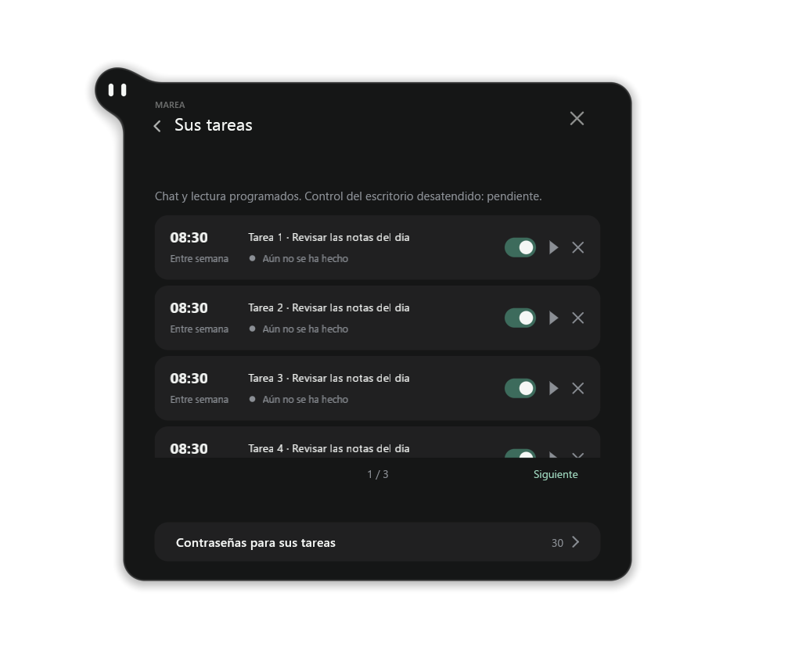
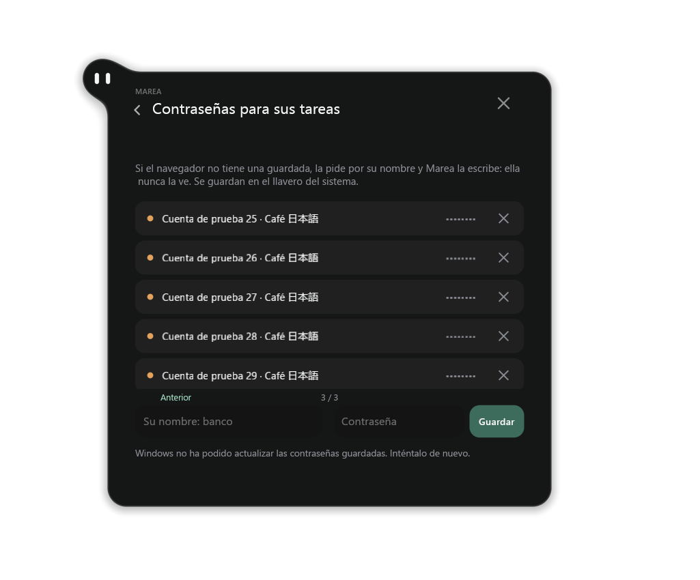

# Scheduled tasks and named credentials on Windows

Upstream `0bc96d5` adds scheduled prompts, saved password names, text selection
and notification clear-all. The Windows branch incorporates these changes with
pleamar 0.2.19 and pleamar-wm 0.2.22.

Ask Marea in the chat to schedule a prompt, confirm its card, then inspect it in
Settings > Talking with her > Her tasks. The list offers pause, run now and
remove. Schedules use local time while Marea is running; they do not wake a
sleeping computer. Missed runs are reported. Storage errors retain the previous
schedule, and a failed conversation archive prevents replacing the current chat.
Up to 120 tasks remain reachable in pages of 12. Stale row events cannot act on
a replacement task.

| Feature | Windows status |
| --- | --- |
| Confirmed schedules, pause/remove/run now | Implemented; shared logic tested with a fixed clock and mocked worker |
| Scheduled chat, memory and window inspection | Implemented; signed-in model execution still needs acceptance |
| Unattended desktop launch or input | Unavailable pending independent Windows agent interaction; explicitly rejected |
| Task notices | Native Windows publishing; errors shown in task settings |
| Task notice action buttons | Native protocol/scene callback implementation with legacy COM routing; actual notification-center clicks remain pending |
| Named passwords | Native Windows Credential Manager; no secret-tool or plaintext JSON values |
| Typing a saved password | Native service with normal foreground/approval guards; real password-field acceptance pending |
| Notification clear-all | Asynchronous native acknowledgements; failures remain pending, snoozed items retained |

Under Passwords for her tasks, save a name and a password. Only names enter the
model context. Windows stores the values, and the native desktop service consumes
them without returning them to Luau/model tools, using process arguments or the
clipboard. Normal interactive chat approval still applies. The scene's masked
input is cleared on successful save. The list pages through all saved names;
failed list/save/delete operations show an error rather than claiming success.

The installer's existing application name remains `marea-desktop`, so updates
keep the same credential namespace. Credentials belong to the Windows account
and are not exported with a portable ZIP. This does not import a Linux keyring.

Task notices offer **Do it now / Leave it** for missed runs and **See it** for
finished runs. They require the paired engine's `pleamar-notifications.exe` and
registered Start-menu shortcut. Missing registration or rejected delivery is
reported in task settings. A selection is delivered to the current scene once;
unknown, duplicate, expired and previous-process tokens cannot execute a task.
Callbacks expire after six hours and on reload/exit. Marea polls only while
callbacks remain, and the existing task callback rechecks that the task still
exists. Clicking an old notice does not start Marea or resurrect a closed task.
These buttons do not grant unattended desktop input or model account access.
The October 6 diagnostic found that automatic COM startup returns
`REGDB_E_CLASSNOTREG` (`0x80040154`) on the local Windows 11 machine, while it
passes in Windows Server 2022 CI. New notices use the installation's native
protocol handler, which launches the windowless broker directly. The engine
tests real protocol startup and one-use callback delivery separately from COM.
Actual notification-center clicks still need acceptance; registry readback or
mocked callback tests are insufficient evidence for them.

```powershell
python windows/build-desktop.py
python windows/test-logic.py --binary ..\pleamar\target\release\pleamar.exe --luau-runner ..\pleamar\target\release\examples\luau-test.exe
python windows/test-chat-memory-native.py --binary ..\pleamar\target\release\pleamar.exe --output .tools\new-memory-validation
```

The logic tests include failed storage, invalid dates/weekdays, failed worker
startup, pagination, stale clicks, credential callback failures and partial
notification deletion. A separate pleamar test exercises real dummy credentials
and cleans up its unique namespace. Neither test authenticates a model account
or types into the user's applications. Real model, physical input and unattended
desktop parity must not be inferred from these checks.

`python windows/test-task-notices.py --luau-runner <luau-test.exe>` checks the
generated Windows notice adapter's one-use callbacks, default click, failed
publication, unavailable service, expiry, retries, 64-callback bound and stopped
idle polling. Native protocol/COM routing and actual Windows toast interaction have
separate acceptance; a mocked service reply is not evidence of a clicked toast.

## Native layout evidence

The generated Spanish UI was rendered in native D3D12 windows on DISPLAY2
at 125% scaling. Sixteen WGC captures cover first/last task and credential
pages and failed read/write/delete states. They use 25 fixture tasks and 30
dummy credential names, with no model account, input injection or real secrets.
The owned windows were non-activating and disabled for input; foreground focus
was unchanged. The captured runtime exited normally.



